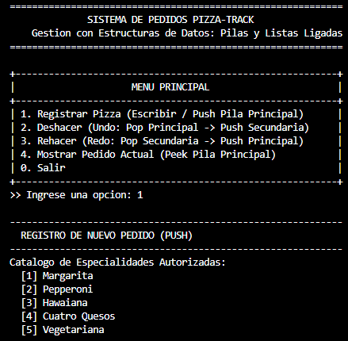

# Pizza Track: Sistema de Gestion de Pedidos

- **Estudiante:** Manuela Duque Contreras
- **Institucion:** IU Digital
- **Materia:** Estructura de Datos

---

## Descripcion

Aplicacion en Java por consola para la gestion de pedidos de una pizzeria (**Pizza Track**). El sistema utiliza **pilas manuales basadas en listas ligadas (nodos y punteros)** sin hacer uso de `java.util.Stack` ni librerias de colecciones predefinidas.

### Funcionalidades:
1. **Registrar Pizza:** Permite seleccionar una especialidad del catalogo oficial y asignar un arreglo estricto de 3 ingredientes (sin repetir). El pedido se apila (`push`) en la Pila Principal.
2. **Deshacer (Undo):** Retira el ultimo pedido activo (`pop`) de la Pila Principal y lo mueve (`push`) a la Pila Secundaria.
3. **Rehacer (Redo):** Restaura el pedido deshecho (`pop` en Pila Secundaria) devolviendolo a la Pila Principal.
4. **Mostrar Pedido Actual:** Consulta el pedido en el tope (`peek`) de la Pila Principal sin retirarlo.
5. **Manejo de Excepciones:** Control de entradas con `TipoPizzaInvalidoException` e `IngredientesInvalidosException`.

---

## Estructura del Proyecto

```text
Pizza-Track/
├── src/
│   ├── Pizza.java                         # Modelo de Pizza (catalogo y arreglo de 3 ingredientes)
│   ├── NodoPizza.java                     # Nodo con dato y enlace al siguiente
│   ├── PilaPizza.java                     # Implementacion manual de la pila (LIFO)
│   ├── GestionPedidos.java                # Controlador de pedidos y pilas Undo/Redo
│   ├── TipoPizzaInvalidoException.java    # Excepcion para tipos fuera de catalogo
│   ├── IngredientesInvalidosException.java# Excepcion para validacion de 3 ingredientes
│   └── Main.java                          # Menu principal interactivo en consola
├── bin/                                   # Archivos compilados (.class)
├── .gitignore
└── README.md
```

---

## Compilacion y Ejecucion

Desde la terminal en la raiz del proyecto:

1. **Compilar:**
   ```bash
   javac -d bin src/*.java
   ```

2. **Ejecutar:**
   ```bash
   java -cp bin Main
   ```

---

## Menu de la Aplicacion

```text
+----------------------------------------------------------+
|                     MENU PRINCIPAL                       |
+----------------------------------------------------------+
| 1. Registrar Pizza (Escribir / Push Pila Principal)      |
| 2. Deshacer (Undo: Pop Principal -> Push Secundaria)     |
| 3. Rehacer (Redo: Pop Secundaria -> Push Principal)      |
| 4. Mostrar Pedido Actual (Peek Pila Principal)           |
| 0. Salir                                                 |
+----------------------------------------------------------+
```

### Catalogos disponibles:
- **Pizzas:** Margarita, Pepperoni, Hawaiana, Cuatro Quesos, Vegetariana, Mexicana, Pollo y Champinones.
- **Ingredientes:** Queso Mozzarella, Salsa de Tomate, Jamon, Pina, Pepperoni, Champinones, Tocineta, Pollo Desmechado, Carne Molida, Cebolla, Pimenton, Aceitunas Negras, Albahaca Fresca, Maiz Tierno.

---

## Evidencias de Ejecucion

- **1. Registro de Pizza:**
---

---

- **2. Mostrar Pedido Actual (Peek):**
---

- **3. Deshacer (Undo):** *(Pega aqui tu captura de consola)*
- **4. Rehacer (Redo):** *(Pega aqui tu captura de consola)*

---

## Enlace del Video de Sustentacion

- **Estudiante:** Manuela Duque Contreras
- **Institucion:** IU Digital
- **Materia:** Estructura de Datos
- **Enlace:** https://youtu.be/jPu3uWoNdJw
